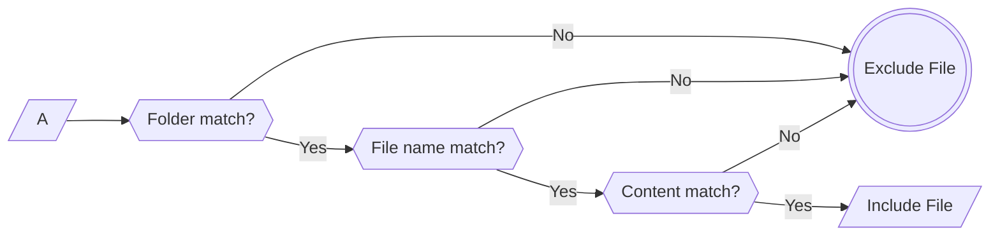

# Project Colector Documentation

**Project Colector** is a Python tool designed to collect file contents and generate a directory structure "tree" for a project. It is highly adaptable and supports both exclusion filters and granular inclusion filters. This documentation explains how to configure and use the tool with clear guidance, ensuring that filtering is applied in the order: Folder → File Name → Content.

> **Key Principle:**  
> For each project, the majority of filter configurations—such as default ignored directories/files and inclusion patterns—should be defined in the `config.json` file. This centralizes and standardizes the setup so that you don't need to repeat long command-line parameters every time. Update the config only when the project structure changes or when new filters are needed. In most cases, 90% of adjustments will be made via the config file, while command-line overrides are used only for temporary modifications.

---

## Table of Contents

- [1. Overview](#1-overview)
- [2. Project Structure](#2-project-structure)
- [3. Configuration File (config.json)](#3-configuration-file-configjson)
- [4. Command-Line Parameters](#4-command-line-parameters)
- [5. Inclusion Filters & Search Mechanism](#5-inclusion-filters--search-mechanism)
- [6. Best Practices](#6-best-practices)
- [7. Troubleshooting](#7-troubleshooting)
- [8. Usage Examples](#8-usage-examples)
- [9. FAQ](#9-faq)
- [10. Output Example & Performance Considerations](#10-output-example--performance-considerations)

---

## 1. Overview

**Project Colector** allows you to:

- **Recursive Reading:** Process a directory or a single file, reading all its contents.
- **File Marking:** Insert start and end markers to indicate where each file begins and ends.
- **Tree Generation:** Create a visual tree of the processed files and folders.
- **Exclusion & Inclusion Filters:** Define which files/folders to ignore and which to process using granular filters based on folder name, file name, and file content.  
  *Note:* The filtering is **cumulative**: a file is included only if it passes **all** filters.

  ### When to Use vs When Not to Use

  **When to use Project Colector**  
  - Mapping the “skeleton” of a feature (all related files + folder tree).  
  - Extracting content from multiple files in one go.

  **When not to use**  
  - When you already know the exact file you need.  
  - For a quick directory overview—use `--only-tree` instead of full content collection.

  ### When to Stop

  You can conclude your collection when:
  - You have identified **all layers** of the feature.  
  - You’ve located every **direct dependency** (helpers, validators) referenced in those files.  
  - You have sufficient context to implement the next steps without further file discovery.

---

## 2. Project Structure

```bash
project_colector/
├── script.py      # Main script to collect file contents and generate the directory tree
├── config.json    # Configuration file with exclusion and inclusion patterns
└── README.md      # This documentation
```

---

## 3. Configuration File (config.json)

The `config.json` file centralizes all configurations so you don’t need to pass numerous command-line parameters. It is intended to be customized per project and should be updated only when necessary. Typically, the defaults in the config represent directories and files that are almost never desired for processing (e.g., `.git`, `node_modules`, etc.), while the inclusion patterns target files that are project-specific.

Each key is defined as follows:

- **DEFAULT_IGNORED_DIRS**  
  Globally ignored directories (e.g., `.git`, `venv`, `node_modules`, `build`, etc.). These defaults are common and rarely need changing.

- **DEFAULT_IGNORED_FILES**  
  Globally ignored files (e.g., `.gitignore`, `.env`, `README.md`, etc.). These usually represent auxiliary files not needed in the collection.

- **ADDITIONAL_IGNORED_DIRS**  
  Extra directories that should not be processed (e.g., `factories`, `repositories`, `ui/pages`, etc.). Customize these for each project.

- **ADDITIONAL_IGNORED_FILES**  
  Extra file exclusions. Update them as needed for your project.

- **INCLUDE_FOLDER_PATTERNS**  
  Inclusion patterns based **on folder names** within the file path. For example, `"*class_management*"` ensures that only files within folders whose name contains that substring are processed.

- **INCLUDE_FILE_PATTERNS**  
  Inclusion patterns based **on the file name**. For example, `"*frequency*.dart"` includes any file whose name contains “frequency” and ends with `.dart`.

- **INCLUDE_CONTENT_PATTERNS**  
  Inclusion patterns based **on file content**. A file is processed only if its content contains **at least one** of the specified substrings.

### Example config.json

```json
{
  "DEFAULT_IGNORED_DIRS": [
    ".git",
    "venv",
    "context_scripts",
    "__pycache__",
    "node_modules",
    "build",
    "ios",
    "android"
  ],
  "DEFAULT_IGNORED_FILES": [
    ".gitignore",
    ".env",
    "jsconfig.json",
    "package.json",
    "package-lock.json",
    "README.md",
    "yarn.lock",
    "babel.config.cjs",
    "jest.config.cjs",
    "pubspec.lock"
  ],
  "ADDITIONAL_IGNORED_DIRS": [
    "factories",
    "repositories",
    "ui/pages",
    "ui/providers",
    "ui/theme"
  ],
  "ADDITIONAL_IGNORED_FILES": [],
  "INCLUDE_FOLDER_PATTERNS": [
    "*class_management*",
    "*home*"
  ],
  "INCLUDE_FILE_PATTERNS": [
    "*frequency*.dart",
    "*lesson*.dart"
  ],
  "INCLUDE_CONTENT_PATTERNS": [
    "frequency",
    "lesson"
  ]
}
```

> **Tip:**  
> Always update the `config.json` file per project. This file is your primary source for filter defaults—adjust it when the project structure changes, rather than relying on long command-line parameters.

---

## 4. Command-Line Parameters

The script accepts several parameters to adjust the filters without modifying `config.json`. However, it is recommended to use the configuration file for permanent settings and reserve command-line parameters for temporary overrides or special cases.

- **`directory`**  
  The file or directory to process.

- **`--only-tree`**
  Will only write output tree the generated file, ignoring the files contents.

- **`--ignore-dir`**  
  Additional directories to ignore beyond those defined in `config.json`.

- **`--ignore-file`**  
  Additional files to ignore beyond those defined in `config.json`.

- **`--include-file`**  
  Inclusion patterns based on the file name (e.g., `"*custom*.dart"`).

- **`--include-folder`**  
  Inclusion patterns based on folder names in the path (e.g., `"*widget*"`).

- **`--include-content`**  
  Inclusion patterns based on file content (e.g., `"TODO"`).

- **`--no-defaults`**  
  Ignores all patterns defined in `config.json` and uses only the command-line parameters.

- **`--output`**  
  Specifies the output file name (default: `output_coleta.txt`).

- **`--verbose`**  
  Activates verbose mode for detailed logging of file processing.

> **Recommendation:**  
> Update `config.json` to define your project's default filters. Use command-line parameters only for temporary adjustments, and always review the config file first before running the script.

---

## 5. Inclusion Filters & Search Mechanism

The filtering process occurs in **three distinct steps**, applied in the following order:

1. **Folder Filter:**  
   The script extracts the directory portion of the file path (using `os.path.dirname`) and splits it into folder names. It then checks if **any** folder in the path matches one of the patterns defined in `INCLUDE_FOLDER_PATTERNS` (or via `--include-folder`).  
   *Note:* This filter does **not** consider the file name itself.

2. **File Name Filter:**  
   The file's basename is compared against the patterns in `INCLUDE_FILE_PATTERNS` (or via `--include-file`). It must match at least one pattern.

3. **Content Filter:**  
   Finally, the file’s entire content is read and evaluated to verify if it contains **at least one** substring from `INCLUDE_CONTENT_PATTERNS` (or via `--include-content`).

A file is included only if it passes **all** these filters.



*Clarification:*

- The **Folder Filter** uses `os.path.dirname(filepath)`, so only the directory components are considered.
- The filtering is **cumulative**; failure in any step excludes the file.

---

## 6. Best Practices

- **Centralize Configuration:**  
  Use `config.json` to define project-wide defaults (e.g., ignored directories like `node_modules`, `.git`, etc.) and inclusion patterns. This minimizes repetitive command-line input and ensures consistent behavior.

- **Filter Tuning Tips:**
  When configuring the filters, keep in mind that applying restrictions — whether by folder name, file name, or content — can overly narrow your search results, potentially excluding relevant files if you don't have a complete understanding of the project's directory structure.
  
  Instead, aim for a balanced approach by using moderately broad folder filters in combination with file name and content filters that target key terms (for example, 'frequency', 'lesson', 'selectedDays', etc.).
  
  This strategy helps reduce the overall sample size without inadvertently filtering out important files. Test and iteratively adjust your configuration to ensure that the output includes all critical files while keeping extraneous data to a minimum.

- **Avoid Redundant Patterns:**  
  Use filters only when necessary. For instance, if the file name uniquely identifies the target files (e.g., `"*frequency*.dart"`), you might not need extra folder or content filters unless additional refinement is required.

- **Use Specific Keywords:**  
  For content filters, choose keywords that uniquely identify the desired files. Avoid overly generic terms that might match unrelated files.

- **Test Incrementally:**  
  Begin with one set of filters (e.g., folder patterns) and verify the output. Then, add additional filters (file name or content) only if needed to narrow the selection.

- **Leverage Command-Line Overrides Sparingly:**  
  Use the `--no-defaults` flag only for temporary overrides. Always prefer updating `config.json` for permanent changes—this ensures both human users and automated systems (like an AI) consistently use the correct defaults.

  ### Iterative Usage Flow

  To avoid overly broad or overly restrictive searches, follow this three-step iterative approach:

  1. **Broad Collection**  
     - **Goal:** Discover the overall scope of files.  
     - **Filter:** Use only `INCLUDE_FILE_PATTERNS` **or** `INCLUDE_CONTENT_PATTERNS`—no folder constraints.  
     - **Example:**  

       ```bash
       py script.py src --include-file "*delete*.ts"
       ```

  2. **Refine by Folder & Name**  
     - **Goal:** Isolate a specific feature or module.  
     - **Filter:** Combine `INCLUDE_FOLDER_PATTERNS` and `INCLUDE_FILE_PATTERNS`, omitting content filters.  
     - **Example:**  

       ```bash
       py script.py src \
         --include-folder "*user*" \
         --include-file "*delete*.ts"
       ```

  3. **Filter by Content**  
     - **Goal:** Find particular functions or dependencies.  
     - **Filter:** Add `INCLUDE_CONTENT_PATTERNS` to the existing folder/name filters.  
     - **Example:**  

       ```bash
       py script.py src \
         --include-folder "*user*" \
         --include-file "*delete*.ts" \
         --include-content "deleteUser"
       ```

  #### Filter Naming Tips

  - **Use feature-centric folder patterns** (e.g. `*people_management*`) instead of full paths.  
  - **To capture UI/controller pairs**, search by class name in content (e.g. `PeopleViewer`) rather than exact file paths.  
  - **When hunting for a helper** function across the codebase, rely on `INCLUDE_CONTENT_PATTERNS` alone to avoid missing files in unexpected folders.

> **Reminder:**  
> Always review and update the config file for your project before running the script. In any task involving the script, ensure the current config is considered (and if necessary, update it or request the current config for context).

---

## 7. Troubleshooting

- **File Not Included:**  
  If an expected file is not processed, verify each filter:
  - Ensure that at least one folder in its path matches the folder pattern.
  - Confirm that the file name meets the file name pattern.
  - Check if the file’s content contains the required substring(s).

- **Overly Restrictive Filters:**  
  Redundant or overlapping filters might inadvertently exclude files. Consider removing duplicate patterns or relaxing content filters if too few files are included.

- **Unreadable Files:**  
  Files that cannot be read (due to permission or encoding issues) are skipped. Use the `--verbose` flag for detailed error messages.

- **Verbose Mode:**  
  Activate `--verbose` to view detailed logging, which can help pinpoint which filter a file fails to pass.

---

## 8. Usage Examples

### Example 1: Default Usage with Config File

Process the current directory using patterns defined in `config.json`:

```bash
py script.py .
```

### Example 2: Adding a Specific Content Filter

Process the `lib/ui` directory and include only files containing "customWord" in addition to the config patterns:

```bash
py script.py lib/ui --include-content "customWord"
```

### Example 3: Overriding Config Patterns

Disable default patterns from `config.json` and use only command-line parameters. For example, collect files ending with `.custom.dart` while ignoring the "docs" directory:

```bash
py script.py lib --no-defaults --include-file "*custom*.dart" --ignore-dir "docs"
```

### Example 4: Granular Filtering

Process the `lib` directory with multiple granular filters:

- **Folder:** Must be within a folder containing "class_management" (`--include-folder`)
- **File Name:** Must contain "frequency" (`--include-file`)
- **Content:** Must contain "lesson" (`--include-content`)

```bash
py script.py lib --include-folder "*class_management*" --include-file "*frequency*.dart" --include-content "lesson"
```

### Example 5: Output Example

*Sample Output (partial):*

```css
/path/to/project
├── >>> main.dart <<<
├── ui
│   ├── components
│   │   └── >>> lesson_frequency_buttons.dart <<<
└── data
    └── models
        └── entities
            └── classroom
                └── >>> user_frequency.dart <<<
```

Files highlighted with `>>>` and `<<<` indicate that they met all inclusion filters; files marked with `(ignored)` (not shown) did not.

---

## 9. FAQ

### Q1: How do inclusion and exclusion filters interact?

- **Exclusion:** The script first discards files and folders matching ignore patterns (from `config.json` and any additional `--ignore-dir`/`--ignore-file` parameters).
- **Inclusion:** It then processes only those files that meet **all** inclusion filters (folder, file name, and content).

### Q2: What if no inclusion filters are provided?

- Without inclusion filters (neither via config nor command-line), the script processes all files that aren’t excluded.

### Q3: How can I create my own inclusion patterns?

- **Wildcards:** Use `*` to represent any sequence of characters (e.g., `"*frequency*.dart"`).
- **Folder Name:** Use `--include-folder` to filter based on folder names.
- **File Name:** Use `--include-file` to filter based solely on the file name.
- **Content:** Use `--include-content` with specific keywords that uniquely identify desired files.

### Q4: Can I combine multiple filters?

- Yes. All inclusion filters are applied cumulatively—a file is included only if it satisfies every active criterion. Avoid overlapping or redundant patterns to prevent unintended exclusions.

### Q5: How do I disable default config patterns?

- Use the `--no-defaults` flag to ignore patterns from `config.json` and rely solely on command-line parameters.

### Q6: What if a file cannot be read?

- Files that cannot be read (due to permission or encoding issues) are skipped. Use `--verbose` for detailed error messages.

### Q7: When should I update the config file?

- **Primary Configuration:** Define project-wide defaults in the config file once per project (e.g., ignored directories like `node_modules`, `.git`).
- **Periodic Updates:** Update the config only when the project structure changes or if new filters are needed. Ideally, most filtering settings should be maintained via `config.json`, with command-line parameters used only for temporary adjustments.

---

## 10. Output Example & Performance Considerations

- **Output Example:**  
  The generated output includes the concatenated contents of all included files, marked by start and end delimiters, followed by a directory tree that visually indicates which files were included (highlighted with `>>>` and `<<<`) and which were ignored.

- **Performance Considerations:**  
  - **Large Files:** Reading the entire content of large files for content filtering may affect performance.
  - **Encoding:** The script assumes UTF-8 encoding; files with other encodings may cause errors.
  - **Verbose Mode:** Detailed logs can slow down execution when processing many files.
